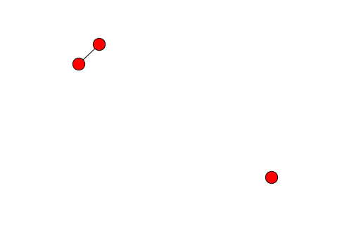

Basic linkage
==================================================

Contents

.. code:: python

    import sys
    sys.path.insert(1, "../recordlinkage")
    
    import pandas as pd
    import numpy as np
    
    import standardise
    reload(standardise)
    
    import indexing
    reload(indexing)

.. parsed-literal::

    <module 'indexing' from '../recordlinkage/indexing.py'>

.. code:: python

    dfA = pd.read_csv('../sampledata/dataset2.csv', index_col='rec_id')
    dfB = pd.read_csv('../sampledata/dataset1.csv', index_col='rec_id')
    
    print "The number of record in dataset A: %s" % len(dfA)
    print "The number of record in dataset B: %s" % len(dfB)
    
    dfB.head()

.. parsed-literal::

    The number of record in dataset A: 5000
    The number of record in dataset B: 1000

.. raw:: html

    

    <table border="1" class="dataframe">
      <thead>
        <tr style="text-align: right;">
          <th></th>
          <th>given_name</th>
          <th>surname</th>
          <th>street_number</th>
          <th>address_1</th>
          <th>address_2</th>
          <th>suburb</th>
          <th>postcode</th>
          <th>state</th>
          <th>date_of_birth</th>
          <th>soc_sec_id</th>
        </tr>
        <tr>
          <th>rec_id</th>
          <th></th>
          <th></th>
          <th></th>
          <th></th>
          <th></th>
          <th></th>
          <th></th>
          <th></th>
          <th></th>
          <th></th>
        </tr>
      </thead>
      <tbody>
        <tr>
          <th>rec-223-org</th>
          <td></td>
          <td>waller</td>
          <td>6</td>
          <td>tullaroop street</td>
          <td>willaroo</td>
          <td>st james</td>
          <td>4011</td>
          <td>wa</td>
          <td>19081209</td>
          <td>6988048</td>
        </tr>
        <tr>
          <th>rec-122-org</th>
          <td>lachlan</td>
          <td>berry</td>
          <td>69</td>
          <td>giblin street</td>
          <td>killarney</td>
          <td>bittern</td>
          <td>4814</td>
          <td>qld</td>
          <td>19990219</td>
          <td>7364009</td>
        </tr>
        <tr>
          <th>rec-373-org</th>
          <td>deakin</td>
          <td>sondergeld</td>
          <td>48</td>
          <td>goldfinch circuit</td>
          <td>kooltuo</td>
          <td>canterbury</td>
          <td>2776</td>
          <td>vic</td>
          <td>19600210</td>
          <td>2635962</td>
        </tr>
        <tr>
          <th>rec-10-dup-0</th>
          <td>kayla</td>
          <td>harrington</td>
          <td></td>
          <td>maltby circuit</td>
          <td>coaling</td>
          <td>coolaroo</td>
          <td>3465</td>
          <td>nsw</td>
          <td>19150612</td>
          <td>9004242</td>
        </tr>
        <tr>
          <th>rec-227-org</th>
          <td>luke</td>
          <td>purdon</td>
          <td>23</td>
          <td>ramsay place</td>
          <td>mirani</td>
          <td>garbutt</td>
          <td>2260</td>
          <td>vic</td>
          <td>19831024</td>
          <td>8099933</td>
        </tr>
      </tbody>
    </table>
    

Create an object Pairs to create candidate record pairs. The class
'Pairs' can take 1 or 2 arguments, both dataframes. If one dataframe is
given, the record pairs are for deduplication. When two dataframes are
given, the data is linked between two files.

.. code:: python

    pairing = indexing.Pairs(dfA, dfB)

The simplest method of comparing record pairs is to compare all possible
records pairs. The method 'full' is used for this. The function takes no
arguments.

.. code:: python

    pairs_full = pairing.full()
    pairs_full.head(10)

.. raw:: html

    

    <table border="1" class="dataframe">
      <thead>
        <tr style="text-align: right;">
          <th></th>
          <th></th>
          <th>given_name_A</th>
          <th>surname_A</th>
          <th>street_number_A</th>
          <th>address_1_A</th>
          <th>address_2_A</th>
          <th>suburb_A</th>
          <th>postcode_A</th>
          <th>state_A</th>
          <th>date_of_birth_A</th>
          <th>soc_sec_id_A</th>
          <th>given_name_B</th>
          <th>surname_B</th>
          <th>street_number_B</th>
          <th>address_1_B</th>
          <th>address_2_B</th>
          <th>suburb_B</th>
          <th>postcode_B</th>
          <th>state_B</th>
          <th>date_of_birth_B</th>
          <th>soc_sec_id_B</th>
        </tr>
        <tr>
          <th>index_A</th>
          <th>index_B</th>
          <th></th>
          <th></th>
          <th></th>
          <th></th>
          <th></th>
          <th></th>
          <th></th>
          <th></th>
          <th></th>
          <th></th>
          <th></th>
          <th></th>
          <th></th>
          <th></th>
          <th></th>
          <th></th>
          <th></th>
          <th></th>
          <th></th>
          <th></th>
        </tr>
      </thead>
      <tbody>
        <tr>
          <th rowspan="10" valign="top">rec-2778-org</th>
          <th>rec-223-org</th>
          <td>sarah</td>
          <td>bruhn</td>
          <td>44</td>
          <td>forbes street</td>
          <td>wintersloe</td>
          <td>kellerberrin</td>
          <td>4510</td>
          <td>vic</td>
          <td>19300213</td>
          <td>7535316</td>
          <td></td>
          <td>waller</td>
          <td>6</td>
          <td>tullaroop street</td>
          <td>willaroo</td>
          <td>st james</td>
          <td>4011</td>
          <td>wa</td>
          <td>19081209</td>
          <td>6988048</td>
        </tr>
        <tr>
          <th>rec-122-org</th>
          <td>sarah</td>
          <td>bruhn</td>
          <td>44</td>
          <td>forbes street</td>
          <td>wintersloe</td>
          <td>kellerberrin</td>
          <td>4510</td>
          <td>vic</td>
          <td>19300213</td>
          <td>7535316</td>
          <td>lachlan</td>
          <td>berry</td>
          <td>69</td>
          <td>giblin street</td>
          <td>killarney</td>
          <td>bittern</td>
          <td>4814</td>
          <td>qld</td>
          <td>19990219</td>
          <td>7364009</td>
        </tr>
        <tr>
          <th>rec-373-org</th>
          <td>sarah</td>
          <td>bruhn</td>
          <td>44</td>
          <td>forbes street</td>
          <td>wintersloe</td>
          <td>kellerberrin</td>
          <td>4510</td>
          <td>vic</td>
          <td>19300213</td>
          <td>7535316</td>
          <td>deakin</td>
          <td>sondergeld</td>
          <td>48</td>
          <td>goldfinch circuit</td>
          <td>kooltuo</td>
          <td>canterbury</td>
          <td>2776</td>
          <td>vic</td>
          <td>19600210</td>
          <td>2635962</td>
        </tr>
        <tr>
          <th>rec-10-dup-0</th>
          <td>sarah</td>
          <td>bruhn</td>
          <td>44</td>
          <td>forbes street</td>
          <td>wintersloe</td>
          <td>kellerberrin</td>
          <td>4510</td>
          <td>vic</td>
          <td>19300213</td>
          <td>7535316</td>
          <td>kayla</td>
          <td>harrington</td>
          <td></td>
          <td>maltby circuit</td>
          <td>coaling</td>
          <td>coolaroo</td>
          <td>3465</td>
          <td>nsw</td>
          <td>19150612</td>
          <td>9004242</td>
        </tr>
        <tr>
          <th>rec-227-org</th>
          <td>sarah</td>
          <td>bruhn</td>
          <td>44</td>
          <td>forbes street</td>
          <td>wintersloe</td>
          <td>kellerberrin</td>
          <td>4510</td>
          <td>vic</td>
          <td>19300213</td>
          <td>7535316</td>
          <td>luke</td>
          <td>purdon</td>
          <td>23</td>
          <td>ramsay place</td>
          <td>mirani</td>
          <td>garbutt</td>
          <td>2260</td>
          <td>vic</td>
          <td>19831024</td>
          <td>8099933</td>
        </tr>
        <tr>
          <th>rec-6-dup-0</th>
          <td>sarah</td>
          <td>bruhn</td>
          <td>44</td>
          <td>forbes street</td>
          <td>wintersloe</td>
          <td>kellerberrin</td>
          <td>4510</td>
          <td>vic</td>
          <td>19300213</td>
          <td>7535316</td>
          <td></td>
          <td>trevorrow</td>
          <td>16</td>
          <td>dumas street</td>
          <td>2/98-latchford barracks</td>
          <td>mount immaney</td>
          <td>2281</td>
          <td>wa</td>
          <td>19530313</td>
          <td>4811642</td>
        </tr>
        <tr>
          <th>rec-190-dup-0</th>
          <td>sarah</td>
          <td>bruhn</td>
          <td>44</td>
          <td>forbes street</td>
          <td>wintersloe</td>
          <td>kellerberrin</td>
          <td>4510</td>
          <td>vic</td>
          <td>19300213</td>
          <td>7535316</td>
          <td>darcie</td>
          <td>turtur</td>
          <td>10</td>
          <td>blacket street</td>
          <td>eureka</td>
          <td>beverly hills</td>
          <td>2263</td>
          <td>nsw</td>
          <td></td>
          <td>2025650</td>
        </tr>
        <tr>
          <th>rec-294-org</th>
          <td>sarah</td>
          <td>bruhn</td>
          <td>44</td>
          <td>forbes street</td>
          <td>wintersloe</td>
          <td>kellerberrin</td>
          <td>4510</td>
          <td>vic</td>
          <td>19300213</td>
          <td>7535316</td>
          <td>william</td>
          <td>bishop</td>
          <td>21</td>
          <td>neworra place</td>
          <td>apmnt 65</td>
          <td>worongary</td>
          <td>6225</td>
          <td>qld</td>
          <td>19490130</td>
          <td>9773843</td>
        </tr>
        <tr>
          <th>rec-206-dup-0</th>
          <td>sarah</td>
          <td>bruhn</td>
          <td>44</td>
          <td>forbes street</td>
          <td>wintersloe</td>
          <td>kellerberrin</td>
          <td>4510</td>
          <td>vic</td>
          <td>19300213</td>
          <td>7535316</td>
          <td></td>
          <td>lombardi</td>
          <td>36</td>
          <td>yerralee road</td>
          <td>leisure living vlge</td>
          <td>carlsruhe</td>
          <td>3149</td>
          <td>qld</td>
          <td>19870919</td>
          <td>1613132</td>
        </tr>
        <tr>
          <th>rec-344-org</th>
          <td>sarah</td>
          <td>bruhn</td>
          <td>44</td>
          <td>forbes street</td>
          <td>wintersloe</td>
          <td>kellerberrin</td>
          <td>4510</td>
          <td>vic</td>
          <td>19300213</td>
          <td>7535316</td>
          <td></td>
          <td>julius</td>
          <td>52</td>
          <td>florey drive</td>
          <td>north stirling downs</td>
          <td>coolaroo</td>
          <td>2259</td>
          <td>qld</td>
          <td>19630521</td>
          <td>1797144</td>
        </tr>
      </tbody>
    </table>
    

Make pairs based on a blocking key. This blocking key can be a list of
blocking keys. In this case 'Surname' was used.

.. code:: python

    pairs_block = pairing.block(' surname')
    pairs_block.head(10)

.. raw:: html

    

    <table border="1" class="dataframe">
      <thead>
        <tr style="text-align: right;">
          <th></th>
          <th></th>
          <th>given_name_A</th>
          <th>surname</th>
          <th>street_number_A</th>
          <th>address_1_A</th>
          <th>address_2_A</th>
          <th>suburb_A</th>
          <th>postcode_A</th>
          <th>state_A</th>
          <th>date_of_birth_A</th>
          <th>soc_sec_id_A</th>
          <th>given_name_B</th>
          <th>street_number_B</th>
          <th>address_1_B</th>
          <th>address_2_B</th>
          <th>suburb_B</th>
          <th>postcode_B</th>
          <th>state_B</th>
          <th>date_of_birth_B</th>
          <th>soc_sec_id_B</th>
        </tr>
        <tr>
          <th>index_A</th>
          <th>index_B</th>
          <th></th>
          <th></th>
          <th></th>
          <th></th>
          <th></th>
          <th></th>
          <th></th>
          <th></th>
          <th></th>
          <th></th>
          <th></th>
          <th></th>
          <th></th>
          <th></th>
          <th></th>
          <th></th>
          <th></th>
          <th></th>
          <th></th>
        </tr>
      </thead>
      <tbody>
        <tr>
          <th rowspan="2" valign="top">rec-3981-org</th>
          <th>rec-104-dup-0</th>
          <td>alicia</td>
          <td>hope</td>
          <td>100</td>
          <td>mansfield place</td>
          <td>sunset</td>
          <td>byford</td>
          <td>6061</td>
          <td>sa</td>
          <td>19421201</td>
          <td>7934773</td>
          <td>april</td>
          <td></td>
          <td>limestone avenue</td>
          <td>west</td>
          <td>como</td>
          <td>2734</td>
          <td>nsw</td>
          <td>19310625</td>
          <td>8416850</td>
        </tr>
        <tr>
          <th>rec-104-org</th>
          <td>alicia</td>
          <td>hope</td>
          <td>100</td>
          <td>mansfield place</td>
          <td>sunset</td>
          <td>byford</td>
          <td>6061</td>
          <td>sa</td>
          <td>19421201</td>
          <td>7934773</td>
          <td>april</td>
          <td>148</td>
          <td>limestone avenue</td>
          <td>west</td>
          <td>como</td>
          <td>2774</td>
          <td>nsw</td>
          <td>19310625</td>
          <td>8416850</td>
        </tr>
        <tr>
          <th rowspan="2" valign="top">rec-2851-org</th>
          <th>rec-104-dup-0</th>
          <td>shana</td>
          <td>hope</td>
          <td>24</td>
          <td>burkitt street</td>
          <td>warra view</td>
          <td>carnegie</td>
          <td>3214</td>
          <td>qld</td>
          <td>19760709</td>
          <td>2091042</td>
          <td>april</td>
          <td></td>
          <td>limestone avenue</td>
          <td>west</td>
          <td>como</td>
          <td>2734</td>
          <td>nsw</td>
          <td>19310625</td>
          <td>8416850</td>
        </tr>
        <tr>
          <th>rec-104-org</th>
          <td>shana</td>
          <td>hope</td>
          <td>24</td>
          <td>burkitt street</td>
          <td>warra view</td>
          <td>carnegie</td>
          <td>3214</td>
          <td>qld</td>
          <td>19760709</td>
          <td>2091042</td>
          <td>april</td>
          <td>148</td>
          <td>limestone avenue</td>
          <td>west</td>
          <td>como</td>
          <td>2774</td>
          <td>nsw</td>
          <td>19310625</td>
          <td>8416850</td>
        </tr>
        <tr>
          <th rowspan="2" valign="top">rec-77-org</th>
          <th>rec-104-dup-0</th>
          <td>lily</td>
          <td>hope</td>
          <td>2</td>
          <td>inkster street</td>
          <td>druid's oak</td>
          <td>berala</td>
          <td>2320</td>
          <td>qld</td>
          <td>19150907</td>
          <td>4726313</td>
          <td>april</td>
          <td></td>
          <td>limestone avenue</td>
          <td>west</td>
          <td>como</td>
          <td>2734</td>
          <td>nsw</td>
          <td>19310625</td>
          <td>8416850</td>
        </tr>
        <tr>
          <th>rec-104-org</th>
          <td>lily</td>
          <td>hope</td>
          <td>2</td>
          <td>inkster street</td>
          <td>druid's oak</td>
          <td>berala</td>
          <td>2320</td>
          <td>qld</td>
          <td>19150907</td>
          <td>4726313</td>
          <td>april</td>
          <td>148</td>
          <td>limestone avenue</td>
          <td>west</td>
          <td>como</td>
          <td>2774</td>
          <td>nsw</td>
          <td>19310625</td>
          <td>8416850</td>
        </tr>
        <tr>
          <th rowspan="2" valign="top">rec-3940-org</th>
          <th>rec-104-dup-0</th>
          <td>joshua</td>
          <td>hope</td>
          <td>27</td>
          <td>southern cross drive</td>
          <td>mindalay appts</td>
          <td>narooma</td>
          <td>3182</td>
          <td>nsw</td>
          <td>19850729</td>
          <td>1189951</td>
          <td>april</td>
          <td></td>
          <td>limestone avenue</td>
          <td>west</td>
          <td>como</td>
          <td>2734</td>
          <td>nsw</td>
          <td>19310625</td>
          <td>8416850</td>
        </tr>
        <tr>
          <th>rec-104-org</th>
          <td>joshua</td>
          <td>hope</td>
          <td>27</td>
          <td>southern cross drive</td>
          <td>mindalay appts</td>
          <td>narooma</td>
          <td>3182</td>
          <td>nsw</td>
          <td>19850729</td>
          <td>1189951</td>
          <td>april</td>
          <td>148</td>
          <td>limestone avenue</td>
          <td>west</td>
          <td>como</td>
          <td>2774</td>
          <td>nsw</td>
          <td>19310625</td>
          <td>8416850</td>
        </tr>
        <tr>
          <th rowspan="2" valign="top">rec-2905-org</th>
          <th>rec-104-dup-0</th>
          <td>ned</td>
          <td>hope</td>
          <td>6</td>
          <td>stokes street</td>
          <td>carrington retirement</td>
          <td>angaston</td>
          <td>2775</td>
          <td>sa</td>
          <td>19660618</td>
          <td>5806509</td>
          <td>april</td>
          <td></td>
          <td>limestone avenue</td>
          <td>west</td>
          <td>como</td>
          <td>2734</td>
          <td>nsw</td>
          <td>19310625</td>
          <td>8416850</td>
        </tr>
        <tr>
          <th>rec-104-org</th>
          <td>ned</td>
          <td>hope</td>
          <td>6</td>
          <td>stokes street</td>
          <td>carrington retirement</td>
          <td>angaston</td>
          <td>2775</td>
          <td>sa</td>
          <td>19660618</td>
          <td>5806509</td>
          <td>april</td>
          <td>148</td>
          <td>limestone avenue</td>
          <td>west</td>
          <td>como</td>
          <td>2774</td>
          <td>nsw</td>
          <td>19310625</td>
          <td>8416850</td>
        </tr>
      </tbody>
    </table>
    

.. code:: python

    pairs_sorted = pairing.sortedneighbourhood(' surname', window=3)
    pairs_sorted.head(10)

.. raw:: html

    

    <table border="1" class="dataframe">
      <thead>
        <tr style="text-align: right;">
          <th></th>
          <th></th>
          <th>given_name_A</th>
          <th>surname_A</th>
          <th>street_number_A</th>
          <th>address_1_A</th>
          <th>address_2_A</th>
          <th>suburb_A</th>
          <th>postcode_A</th>
          <th>state_A</th>
          <th>date_of_birth_A</th>
          <th>soc_sec_id_A</th>
          <th>given_name_B</th>
          <th>surname_B</th>
          <th>street_number_B</th>
          <th>address_1_B</th>
          <th>address_2_B</th>
          <th>suburb_B</th>
          <th>postcode_B</th>
          <th>state_B</th>
          <th>date_of_birth_B</th>
          <th>soc_sec_id_B</th>
        </tr>
        <tr>
          <th>index_A</th>
          <th>index_B</th>
          <th></th>
          <th></th>
          <th></th>
          <th></th>
          <th></th>
          <th></th>
          <th></th>
          <th></th>
          <th></th>
          <th></th>
          <th></th>
          <th></th>
          <th></th>
          <th></th>
          <th></th>
          <th></th>
          <th></th>
          <th></th>
          <th></th>
          <th></th>
        </tr>
      </thead>
      <tbody>
        <tr>
          <th rowspan="2" valign="top">rec-1274-org</th>
          <th>rec-365-org</th>
          <td>joshua</td>
          <td>rudd</td>
          <td>78</td>
          <td>max henry crescent</td>
          <td>brentwood vlge</td>
          <td>port douglas</td>
          <td>2315</td>
          <td>vic</td>
          <td>19951125</td>
          <td>1697892</td>
          <td>stephanie</td>
          <td>rumbal</td>
          <td>26</td>
          <td>sollya place</td>
          <td>erina ardns</td>
          <td>galston</td>
          <td>6285</td>
          <td>nsw</td>
          <td>19150614</td>
          <td>5779913</td>
        </tr>
        <tr>
          <th>rec-250-org</th>
          <td>joshua</td>
          <td>rudd</td>
          <td>78</td>
          <td>max henry crescent</td>
          <td>brentwood vlge</td>
          <td>port douglas</td>
          <td>2315</td>
          <td>vic</td>
          <td>19951125</td>
          <td>1697892</td>
          <td>stephanie</td>
          <td>rumbal</td>
          <td>26</td>
          <td>griffin place</td>
          <td>erina gardns</td>
          <td>galston</td>
          <td>6258</td>
          <td>nsw</td>
          <td>19710718</td>
          <td>5779913</td>
        </tr>
        <tr>
          <th rowspan="2" valign="top">rec-704-org</th>
          <th>rec-365-org</th>
          <td>joshua</td>
          <td>rudd</td>
          <td>78</td>
          <td>max henry vrescent</td>
          <td>brentowo d vlge</td>
          <td>port douoglas</td>
          <td>2335</td>
          <td>vic</td>
          <td>19951125</td>
          <td>1697892</td>
          <td>stephanie</td>
          <td>rumbal</td>
          <td>26</td>
          <td>sollya place</td>
          <td>erina ardns</td>
          <td>galston</td>
          <td>6285</td>
          <td>nsw</td>
          <td>19150614</td>
          <td>5779913</td>
        </tr>
        <tr>
          <th>rec-250-org</th>
          <td>joshua</td>
          <td>rudd</td>
          <td>78</td>
          <td>max henry vrescent</td>
          <td>brentowo d vlge</td>
          <td>port douoglas</td>
          <td>2335</td>
          <td>vic</td>
          <td>19951125</td>
          <td>1697892</td>
          <td>stephanie</td>
          <td>rumbal</td>
          <td>26</td>
          <td>griffin place</td>
          <td>erina gardns</td>
          <td>galston</td>
          <td>6258</td>
          <td>nsw</td>
          <td>19710718</td>
          <td>5779913</td>
        </tr>
        <tr>
          <th>rec-3857-org</th>
          <th>rec-180-dup-0</th>
          <td>andrew</td>
          <td>carbone</td>
          <td>191</td>
          <td>jabanungga avenue</td>
          <td>villa 147 henry kendall bayside</td>
          <td>malvern east</td>
          <td>5631</td>
          <td>vic</td>
          <td>19720809</td>
          <td>6909412</td>
          <td>patrick</td>
          <td>carr exa</td>
          <td>78</td>
          <td>carnegie crescent</td>
          <td>binna long</td>
          <td>towragi</td>
          <td>3802</td>
          <td>wa</td>
          <td>19290412</td>
          <td>1595174</td>
        </tr>
        <tr>
          <th>rec-292-org</th>
          <th>rec-180-dup-0</th>
          <td>archie</td>
          <td>carbone</td>
          <td>22</td>
          <td>callabonna street</td>
          <td>rosetta village</td>
          <td>bayswater</td>
          <td>3147</td>
          <td>qld</td>
          <td>19790405</td>
          <td>2459626</td>
          <td>patrick</td>
          <td>carr exa</td>
          <td>78</td>
          <td>carnegie crescent</td>
          <td>binna long</td>
          <td>towragi</td>
          <td>3802</td>
          <td>wa</td>
          <td>19290412</td>
          <td>1595174</td>
        </tr>
        <tr>
          <th>rec-1423-org</th>
          <th>rec-180-dup-0</th>
          <td>kane</td>
          <td>carbone</td>
          <td>42</td>
          <td>risdon place</td>
          <td>parkside flats</td>
          <td>san remo</td>
          <td>4158</td>
          <td>nsw</td>
          <td>19781008</td>
          <td>8437775</td>
          <td>patrick</td>
          <td>carr exa</td>
          <td>78</td>
          <td>carnegie crescent</td>
          <td>binna long</td>
          <td>towragi</td>
          <td>3802</td>
          <td>wa</td>
          <td>19290412</td>
          <td>1595174</td>
        </tr>
        <tr>
          <th>rec-3558-org</th>
          <th>rec-180-dup-0</th>
          <td>hannah</td>
          <td>carbone</td>
          <td>45</td>
          <td>moseley place</td>
          <td></td>
          <td>carrara</td>
          <td>2470</td>
          <td>sa</td>
          <td>19561208</td>
          <td>5723073</td>
          <td>patrick</td>
          <td>carr exa</td>
          <td>78</td>
          <td>carnegie crescent</td>
          <td>binna long</td>
          <td>towragi</td>
          <td>3802</td>
          <td>wa</td>
          <td>19290412</td>
          <td>1595174</td>
        </tr>
        <tr>
          <th>rec-337-org</th>
          <th>rec-180-dup-0</th>
          <td>katelin</td>
          <td>carbone</td>
          <td>177</td>
          <td>bromell circuit</td>
          <td>moorefields</td>
          <td>seelands</td>
          <td>2471</td>
          <td>nsw</td>
          <td>19931121</td>
          <td>8403630</td>
          <td>patrick</td>
          <td>carr exa</td>
          <td>78</td>
          <td>carnegie crescent</td>
          <td>binna long</td>
          <td>towragi</td>
          <td>3802</td>
          <td>wa</td>
          <td>19290412</td>
          <td>1595174</td>
        </tr>
        <tr>
          <th>rec-320-org</th>
          <th>rec-180-dup-0</th>
          <td>jessica</td>
          <td>carbone</td>
          <td>2</td>
          <td>melbourne avenue</td>
          <td>buckamall</td>
          <td>safety beach</td>
          <td>2132</td>
          <td>sa</td>
          <td>19010826</td>
          <td>9894414</td>
          <td>patrick</td>
          <td>carr exa</td>
          <td>78</td>
          <td>carnegie crescent</td>
          <td>binna long</td>
          <td>towragi</td>
          <td>3802</td>
          <td>wa</td>
          <td>19290412</td>
          <td>1595174</td>
        </tr>
      </tbody>
    </table>
    

.. code:: python

    pairs_sorted_with_block = pairing.sortedneighbourhood(' given_name', window=3, blocking_on=[' surname'])
    pairs_sorted_with_block.head(10)

.. raw:: html

    

    <table border="1" class="dataframe">
      <thead>
        <tr style="text-align: right;">
          <th></th>
          <th></th>
          <th>address_2_A</th>
          <th>state_B</th>
          <th>suburb_B</th>
          <th>suburb_A</th>
          <th>state_A</th>
          <th>address_2_B</th>
          <th>given_name_B</th>
          <th>given_name_A</th>
          <th>surname</th>
          <th>soc_sec_id_A</th>
          <th>soc_sec_id_B</th>
          <th>address_1_A</th>
          <th>postcode_B</th>
          <th>postcode_A</th>
          <th>street_number_A</th>
          <th>street_number_B</th>
          <th>address_1_B</th>
          <th>date_of_birth_B</th>
          <th>date_of_birth_A</th>
        </tr>
        <tr>
          <th>index_A</th>
          <th>index_B</th>
          <th></th>
          <th></th>
          <th></th>
          <th></th>
          <th></th>
          <th></th>
          <th></th>
          <th></th>
          <th></th>
          <th></th>
          <th></th>
          <th></th>
          <th></th>
          <th></th>
          <th></th>
          <th></th>
          <th></th>
          <th></th>
          <th></th>
        </tr>
      </thead>
      <tbody>
        <tr>
          <th>rec-2586-org</th>
          <th>rec-126-org</th>
          <td>tiberoo</td>
          <td>nsw</td>
          <td>malvern east</td>
          <td>alice springs</td>
          <td>nsw</td>
          <td>rosedale</td>
          <td>molly</td>
          <td>mitchell</td>
          <td>webb</td>
          <td>1297404</td>
          <td>5572942</td>
          <td>kearne place</td>
          <td>5023</td>
          <td>4370</td>
          <td>61</td>
          <td>440</td>
          <td>mccombie street</td>
          <td>19150416</td>
          <td>19421017</td>
        </tr>
        <tr>
          <th>rec-594-dup-2</th>
          <th>rec-155-org</th>
          <td>rosedown</td>
          <td>qld</td>
          <td>boundary bend</td>
          <td>armidale</td>
          <td>act</td>
          <td>wallace heights</td>
          <td>emma</td>
          <td>emiily</td>
          <td>green</td>
          <td>8733127</td>
          <td>9262880</td>
          <td>robsontreet</td>
          <td>2747</td>
          <td>7008</td>
          <td>25</td>
          <td>30</td>
          <td>learmonth drive</td>
          <td>19310903</td>
          <td>19930903</td>
        </tr>
        <tr>
          <th>rec-3022-org</th>
          <th>rec-155-org</th>
          <td>rosedown</td>
          <td>qld</td>
          <td>boundary bend</td>
          <td>armidale</td>
          <td>act</td>
          <td>wallace heights</td>
          <td>emma</td>
          <td>emiily</td>
          <td>green</td>
          <td>8733127</td>
          <td>9262880</td>
          <td>robson street</td>
          <td>2747</td>
          <td>7008</td>
          <td>25</td>
          <td>30</td>
          <td>learmonth drive</td>
          <td>19310903</td>
          <td>19930903</td>
        </tr>
        <tr>
          <th>rec-1747-org</th>
          <th>rec-155-org</th>
          <td>rosedown</td>
          <td>qld</td>
          <td>boundary bend</td>
          <td>armidsle</td>
          <td>act</td>
          <td>wallace heights</td>
          <td>emma</td>
          <td>emiily</td>
          <td>green</td>
          <td>8733127</td>
          <td>9262880</td>
          <td>robson street</td>
          <td>2747</td>
          <td>7008</td>
          <td></td>
          <td>30</td>
          <td>learmonth drive</td>
          <td>19310903</td>
          <td>19930903</td>
        </tr>
        <tr>
          <th>rec-2346-org</th>
          <th>rec-155-org</th>
          <td></td>
          <td>qld</td>
          <td>boundary bend</td>
          <td>somerton park</td>
          <td>vic</td>
          <td>wallace heights</td>
          <td>emma</td>
          <td>emiily</td>
          <td>green</td>
          <td>7855331</td>
          <td>9262880</td>
          <td>freda bennett circuit</td>
          <td>2747</td>
          <td>5109</td>
          <td></td>
          <td>30</td>
          <td>learmonth drive</td>
          <td>19310903</td>
          <td>19880427</td>
        </tr>
        <tr>
          <th>rec-3774-dup-0</th>
          <th>rec-155-org</th>
          <td>jaybees</td>
          <td>qld</td>
          <td>boundary bend</td>
          <td>deer park</td>
          <td>vic</td>
          <td>wallace heights</td>
          <td>emma</td>
          <td>emiily</td>
          <td>green</td>
          <td>1702626</td>
          <td>9262880</td>
          <td>carron street</td>
          <td>2747</td>
          <td>2400</td>
          <td>15</td>
          <td>30</td>
          <td>learmonth drive</td>
          <td>19310903</td>
          <td>19970228</td>
        </tr>
        <tr>
          <th>rec-687-org</th>
          <th>rec-299-org</th>
          <td>hardways</td>
          <td>nsw</td>
          <td>denistone east</td>
          <td>bacchus marsh</td>
          <td>nsw</td>
          <td></td>
          <td>haylqey</td>
          <td>hayden</td>
          <td></td>
          <td>7392433</td>
          <td>7562395</td>
          <td>lewis luxton avenue</td>
          <td>2766</td>
          <td>4501</td>
          <td>126</td>
          <td>11</td>
          <td></td>
          <td>19120607</td>
          <td>19361226</td>
        </tr>
        <tr>
          <th>rec-1477-dup-0</th>
          <th>rec-129-dup-0</th>
          <td>rosetta village</td>
          <td>qld</td>
          <td></td>
          <td>toormina</td>
          <td>qld</td>
          <td></td>
          <td>brandon</td>
          <td>bradley</td>
          <td>white</td>
          <td>7769920</td>
          <td>9695343</td>
          <td>hammond close</td>
          <td>5159</td>
          <td>4169</td>
          <td>16</td>
          <td>11</td>
          <td>winser crescent</td>
          <td>19911102</td>
          <td>19210921</td>
        </tr>
        <tr>
          <th>rec-348-org</th>
          <th>rec-72-org</th>
          <td>peppercorn lodge</td>
          <td>vic</td>
          <td>lalor park</td>
          <td>avondale heights</td>
          <td>wa</td>
          <td>sec 791</td>
          <td>olivia</td>
          <td>noah</td>
          <td></td>
          <td>3457516</td>
          <td>2042439</td>
          <td>leane street</td>
          <td>2090</td>
          <td>4127</td>
          <td>9</td>
          <td>65</td>
          <td>hobart place</td>
          <td>19200321</td>
          <td>19351124</td>
        </tr>
        <tr>
          <th>rec-3752-org</th>
          <th>rec-28-org</th>
          <td>mayflower retrmnt vlge</td>
          <td>qld</td>
          <td>colac</td>
          <td>glenmore park</td>
          <td>vic</td>
          <td>underbank</td>
          <td>caresse</td>
          <td>cameron</td>
          <td>nguyen</td>
          <td>2104963</td>
          <td>5908395</td>
          <td>bullala court</td>
          <td>2198</td>
          <td>7006</td>
          <td>6</td>
          <td></td>
          <td>roseworthy crescent</td>
          <td>19011004</td>
          <td>19700711</td>
        </tr>
      </tbody>
    </table>
    

.. code:: python

    for pairs in pairing.iterindex(indexing._fullindex, 1000,1000):
        
        pass

This is the same as the following code.

.. code:: python

    for pairs in pairing.iterfull(1000,1000):
        
        pass

Also blocking and sorted neighbourhood indexing can be used with
iterations. The number of records pairs is not always equal for each
iteration.

.. code:: python

    for pairs in pairing.iterblock(1000,1000, ' surname'):
    
        pass

.. code:: python

    pairing.sortedneighbourhood(' surname')

.. raw:: html

    

    <table border="1" class="dataframe">
      <thead>
        <tr style="text-align: right;">
          <th></th>
          <th></th>
          <th>given_name_A</th>
          <th>surname_A</th>
          <th>street_number_A</th>
          <th>address_1_A</th>
          <th>address_2_A</th>
          <th>suburb_A</th>
          <th>postcode_A</th>
          <th>state_A</th>
          <th>date_of_birth_A</th>
          <th>soc_sec_id_A</th>
          <th>given_name_B</th>
          <th>surname_B</th>
          <th>street_number_B</th>
          <th>address_1_B</th>
          <th>address_2_B</th>
          <th>suburb_B</th>
          <th>postcode_B</th>
          <th>state_B</th>
          <th>date_of_birth_B</th>
          <th>soc_sec_id_B</th>
        </tr>
        <tr>
          <th>index_A</th>
          <th>index_B</th>
          <th></th>
          <th></th>
          <th></th>
          <th></th>
          <th></th>
          <th></th>
          <th></th>
          <th></th>
          <th></th>
          <th></th>
          <th></th>
          <th></th>
          <th></th>
          <th></th>
          <th></th>
          <th></th>
          <th></th>
          <th></th>
          <th></th>
          <th></th>
        </tr>
      </thead>
      <tbody>
        <tr>
          <th rowspan="2" valign="top">rec-1274-org</th>
          <th>rec-365-org</th>
          <td>joshua</td>
          <td>rudd</td>
          <td>78</td>
          <td>max henry crescent</td>
          <td>brentwood vlge</td>
          <td>port douglas</td>
          <td>2315</td>
          <td>vic</td>
          <td>19951125</td>
          <td>1697892</td>
          <td>stephanie</td>
          <td>rumbal</td>
          <td>26</td>
          <td>sollya place</td>
          <td>erina ardns</td>
          <td>galston</td>
          <td>6285</td>
          <td>nsw</td>
          <td>19150614</td>
          <td>5779913</td>
        </tr>
        <tr>
          <th>rec-250-org</th>
          <td>joshua</td>
          <td>rudd</td>
          <td>78</td>
          <td>max henry crescent</td>
          <td>brentwood vlge</td>
          <td>port douglas</td>
          <td>2315</td>
          <td>vic</td>
          <td>19951125</td>
          <td>1697892</td>
          <td>stephanie</td>
          <td>rumbal</td>
          <td>26</td>
          <td>griffin place</td>
          <td>erina gardns</td>
          <td>galston</td>
          <td>6258</td>
          <td>nsw</td>
          <td>19710718</td>
          <td>5779913</td>
        </tr>
        <tr>
          <th rowspan="2" valign="top">rec-704-org</th>
          <th>rec-365-org</th>
          <td>joshua</td>
          <td>rudd</td>
          <td>78</td>
          <td>max henry vrescent</td>
          <td>brentowo d vlge</td>
          <td>port douoglas</td>
          <td>2335</td>
          <td>vic</td>
          <td>19951125</td>
          <td>1697892</td>
          <td>stephanie</td>
          <td>rumbal</td>
          <td>26</td>
          <td>sollya place</td>
          <td>erina ardns</td>
          <td>galston</td>
          <td>6285</td>
          <td>nsw</td>
          <td>19150614</td>
          <td>5779913</td>
        </tr>
        <tr>
          <th>rec-250-org</th>
          <td>joshua</td>
          <td>rudd</td>
          <td>78</td>
          <td>max henry vrescent</td>
          <td>brentowo d vlge</td>
          <td>port douoglas</td>
          <td>2335</td>
          <td>vic</td>
          <td>19951125</td>
          <td>1697892</td>
          <td>stephanie</td>
          <td>rumbal</td>
          <td>26</td>
          <td>griffin place</td>
          <td>erina gardns</td>
          <td>galston</td>
          <td>6258</td>
          <td>nsw</td>
          <td>19710718</td>
          <td>5779913</td>
        </tr>
        <tr>
          <th>rec-3857-org</th>
          <th>rec-180-dup-0</th>
          <td>andrew</td>
          <td>carbone</td>
          <td>191</td>
          <td>jabanungga avenue</td>
          <td>villa 147 henry kendall bayside</td>
          <td>malvern east</td>
          <td>5631</td>
          <td>vic</td>
          <td>19720809</td>
          <td>6909412</td>
          <td>patrick</td>
          <td>carr exa</td>
          <td>78</td>
          <td>carnegie crescent</td>
          <td>binna long</td>
          <td>towragi</td>
          <td>3802</td>
          <td>wa</td>
          <td>19290412</td>
          <td>1595174</td>
        </tr>
        <tr>
          <th>rec-292-org</th>
          <th>rec-180-dup-0</th>
          <td>archie</td>
          <td>carbone</td>
          <td>22</td>
          <td>callabonna street</td>
          <td>rosetta village</td>
          <td>bayswater</td>
          <td>3147</td>
          <td>qld</td>
          <td>19790405</td>
          <td>2459626</td>
          <td>patrick</td>
          <td>carr exa</td>
          <td>78</td>
          <td>carnegie crescent</td>
          <td>binna long</td>
          <td>towragi</td>
          <td>3802</td>
          <td>wa</td>
          <td>19290412</td>
          <td>1595174</td>
        </tr>
        <tr>
          <th>rec-1423-org</th>
          <th>rec-180-dup-0</th>
          <td>kane</td>
          <td>carbone</td>
          <td>42</td>
          <td>risdon place</td>
          <td>parkside flats</td>
          <td>san remo</td>
          <td>4158</td>
          <td>nsw</td>
          <td>19781008</td>
          <td>8437775</td>
          <td>patrick</td>
          <td>carr exa</td>
          <td>78</td>
          <td>carnegie crescent</td>
          <td>binna long</td>
          <td>towragi</td>
          <td>3802</td>
          <td>wa</td>
          <td>19290412</td>
          <td>1595174</td>
        </tr>
        <tr>
          <th>rec-3558-org</th>
          <th>rec-180-dup-0</th>
          <td>hannah</td>
          <td>carbone</td>
          <td>45</td>
          <td>moseley place</td>
          <td></td>
          <td>carrara</td>
          <td>2470</td>
          <td>sa</td>
          <td>19561208</td>
          <td>5723073</td>
          <td>patrick</td>
          <td>carr exa</td>
          <td>78</td>
          <td>carnegie crescent</td>
          <td>binna long</td>
          <td>towragi</td>
          <td>3802</td>
          <td>wa</td>
          <td>19290412</td>
          <td>1595174</td>
        </tr>
        <tr>
          <th>rec-337-org</th>
          <th>rec-180-dup-0</th>
          <td>katelin</td>
          <td>carbone</td>
          <td>177</td>
          <td>bromell circuit</td>
          <td>moorefields</td>
          <td>seelands</td>
          <td>2471</td>
          <td>nsw</td>
          <td>19931121</td>
          <td>8403630</td>
          <td>patrick</td>
          <td>carr exa</td>
          <td>78</td>
          <td>carnegie crescent</td>
          <td>binna long</td>
          <td>towragi</td>
          <td>3802</td>
          <td>wa</td>
          <td>19290412</td>
          <td>1595174</td>
        </tr>
        <tr>
          <th>rec-320-org</th>
          <th>rec-180-dup-0</th>
          <td>jessica</td>
          <td>carbone</td>
          <td>2</td>
          <td>melbourne avenue</td>
          <td>buckamall</td>
          <td>safety beach</td>
          <td>2132</td>
          <td>sa</td>
          <td>19010826</td>
          <td>9894414</td>
          <td>patrick</td>
          <td>carr exa</td>
          <td>78</td>
          <td>carnegie crescent</td>
          <td>binna long</td>
          <td>towragi</td>
          <td>3802</td>
          <td>wa</td>
          <td>19290412</td>
          <td>1595174</td>
        </tr>
        <tr>
          <th>rec-237-org</th>
          <th>rec-180-dup-0</th>
          <td>emiily</td>
          <td>carbone</td>
          <td>34</td>
          <td>nardoo crescent</td>
          <td>lazy acres</td>
          <td>old toongabbie</td>
          <td>6280</td>
          <td>nsw</td>
          <td>19841013</td>
          <td>7068798</td>
          <td>patrick</td>
          <td>carr exa</td>
          <td>78</td>
          <td>carnegie crescent</td>
          <td>binna long</td>
          <td>towragi</td>
          <td>3802</td>
          <td>wa</td>
          <td>19290412</td>
          <td>1595174</td>
        </tr>
        <tr>
          <th>rec-2273-org</th>
          <th>rec-180-dup-0</th>
          <td>david</td>
          <td>carbone</td>
          <td>1</td>
          <td>sinclair street</td>
          <td>kinross</td>
          <td>bull creek</td>
          <td>2480</td>
          <td>vic</td>
          <td>19321127</td>
          <td>8971131</td>
          <td>patrick</td>
          <td>carr exa</td>
          <td>78</td>
          <td>carnegie crescent</td>
          <td>binna long</td>
          <td>towragi</td>
          <td>3802</td>
          <td>wa</td>
          <td>19290412</td>
          <td>1595174</td>
        </tr>
        <tr>
          <th rowspan="2" valign="top">rec-2249-org</th>
          <th>rec-89-org</th>
          <td>michael</td>
          <td>dods</td>
          <td></td>
          <td>wilhelmi crescent</td>
          <td>cherrymount</td>
          <td>young</td>
          <td>4504</td>
          <td>nsw</td>
          <td>19700916</td>
          <td>2217360</td>
          <td>joshua</td>
          <td>dolan</td>
          <td>98</td>
          <td>colborne place</td>
          <td>warowie</td>
          <td>lindfield</td>
          <td>3568</td>
          <td>nsw</td>
          <td>19521116</td>
          <td>9500871</td>
        </tr>
        <tr>
          <th>rec-216-org</th>
          <td>michael</td>
          <td>dods</td>
          <td></td>
          <td>wilhelmi crescent</td>
          <td>cherrymount</td>
          <td>young</td>
          <td>4504</td>
          <td>nsw</td>
          <td>19700916</td>
          <td>2217360</td>
          <td>joshua</td>
          <td>dolan</td>
          <td>98</td>
          <td>colborne place</td>
          <td>warowiw</td>
          <td>lindfield</td>
          <td>3568</td>
          <td>nsw</td>
          <td>19521116</td>
          <td>9500871</td>
        </tr>
        <tr>
          <th>rec-1152-org</th>
          <th>rec-212-org</th>
          <td>liam</td>
          <td>karahalios</td>
          <td>13</td>
          <td>severne crescent</td>
          <td>devonport vacation vlge</td>
          <td>toorak</td>
          <td>6026</td>
          <td>nsw</td>
          <td>19230614</td>
          <td>7282976</td>
          <td>lachlan</td>
          <td>katsiavos</td>
          <td>29</td>
          <td>paul coe cdrescent</td>
          <td></td>
          <td>casual</td>
          <td>2913</td>
          <td>nsw</td>
          <td>19380406</td>
          <td>4112327</td>
        </tr>
        <tr>
          <th rowspan="2" valign="top">rec-3584-org</th>
          <th>rec-187-dup-0</th>
          <td>lucas</td>
          <td>mccarthy</td>
          <td>50</td>
          <td>nicklin crescent</td>
          <td></td>
          <td>bayswater</td>
          <td>2144</td>
          <td>nsw</td>
          <td>19601101</td>
          <td>5188554</td>
          <td>mitchell</td>
          <td>mcconnel</td>
          <td>5</td>
          <td>templeton street</td>
          <td>gle n ayre</td>
          <td>camdn</td>
          <td>2500</td>
          <td>vic</td>
          <td>19370615</td>
          <td>3413425</td>
        </tr>
        <tr>
          <th>rec-406-org</th>
          <td>lucas</td>
          <td>mccarthy</td>
          <td>50</td>
          <td>nicklin crescent</td>
          <td></td>
          <td>bayswater</td>
          <td>2144</td>
          <td>nsw</td>
          <td>19601101</td>
          <td>5188554</td>
          <td>mitchell</td>
          <td>mcconnel</td>
          <td>5</td>
          <td>templeton street</td>
          <td>glen ayre</td>
          <td>camden</td>
          <td>2500</td>
          <td>vic</td>
          <td>19370615</td>
          <td>3413425</td>
        </tr>
        <tr>
          <th rowspan="2" valign="top">rec-3332-org</th>
          <th>rec-187-dup-0</th>
          <td>jack</td>
          <td>mccarthy</td>
          <td>60</td>
          <td>downward place</td>
          <td></td>
          <td>eaton</td>
          <td>3158</td>
          <td>sa</td>
          <td>19230617</td>
          <td>8511075</td>
          <td>mitchell</td>
          <td>mcconnel</td>
          <td>5</td>
          <td>templeton street</td>
          <td>gle n ayre</td>
          <td>camdn</td>
          <td>2500</td>
          <td>vic</td>
          <td>19370615</td>
          <td>3413425</td>
        </tr>
        <tr>
          <th>rec-406-org</th>
          <td>jack</td>
          <td>mccarthy</td>
          <td>60</td>
          <td>downward place</td>
          <td></td>
          <td>eaton</td>
          <td>3158</td>
          <td>sa</td>
          <td>19230617</td>
          <td>8511075</td>
          <td>mitchell</td>
          <td>mcconnel</td>
          <td>5</td>
          <td>templeton street</td>
          <td>glen ayre</td>
          <td>camden</td>
          <td>2500</td>
          <td>vic</td>
          <td>19370615</td>
          <td>3413425</td>
        </tr>
        <tr>
          <th rowspan="2" valign="top">rec-528-org</th>
          <th>rec-187-dup-0</th>
          <td>rhys</td>
          <td>mccarthy</td>
          <td>10</td>
          <td>horsley crescent</td>
          <td>myranda</td>
          <td>rankin park</td>
          <td>4350</td>
          <td>nsw</td>
          <td>19400913</td>
          <td>3669234</td>
          <td>mitchell</td>
          <td>mcconnel</td>
          <td>5</td>
          <td>templeton street</td>
          <td>gle n ayre</td>
          <td>camdn</td>
          <td>2500</td>
          <td>vic</td>
          <td>19370615</td>
          <td>3413425</td>
        </tr>
        <tr>
          <th>rec-406-org</th>
          <td>rhys</td>
          <td>mccarthy</td>
          <td>10</td>
          <td>horsley crescent</td>
          <td>myranda</td>
          <td>rankin park</td>
          <td>4350</td>
          <td>nsw</td>
          <td>19400913</td>
          <td>3669234</td>
          <td>mitchell</td>
          <td>mcconnel</td>
          <td>5</td>
          <td>templeton street</td>
          <td>glen ayre</td>
          <td>camden</td>
          <td>2500</td>
          <td>vic</td>
          <td>19370615</td>
          <td>3413425</td>
        </tr>
        <tr>
          <th rowspan="2" valign="top">rec-12-org</th>
          <th>rec-187-dup-0</th>
          <td>brianna</td>
          <td>mccarthy</td>
          <td>85</td>
          <td>warrai place</td>
          <td>kooraegula</td>
          <td>orange</td>
          <td>4077</td>
          <td>qld</td>
          <td>19110323</td>
          <td>5030053</td>
          <td>mitchell</td>
          <td>mcconnel</td>
          <td>5</td>
          <td>templeton street</td>
          <td>gle n ayre</td>
          <td>camdn</td>
          <td>2500</td>
          <td>vic</td>
          <td>19370615</td>
          <td>3413425</td>
        </tr>
        <tr>
          <th>rec-406-org</th>
          <td>brianna</td>
          <td>mccarthy</td>
          <td>85</td>
          <td>warrai place</td>
          <td>kooraegula</td>
          <td>orange</td>
          <td>4077</td>
          <td>qld</td>
          <td>19110323</td>
          <td>5030053</td>
          <td>mitchell</td>
          <td>mcconnel</td>
          <td>5</td>
          <td>templeton street</td>
          <td>glen ayre</td>
          <td>camden</td>
          <td>2500</td>
          <td>vic</td>
          <td>19370615</td>
          <td>3413425</td>
        </tr>
        <tr>
          <th rowspan="2" valign="top">rec-387-org</th>
          <th>rec-187-dup-0</th>
          <td>luke</td>
          <td>mccarthy</td>
          <td>43</td>
          <td>cullen street</td>
          <td></td>
          <td>mentone</td>
          <td>2316</td>
          <td>sa</td>
          <td>19740312</td>
          <td>4343061</td>
          <td>mitchell</td>
          <td>mcconnel</td>
          <td>5</td>
          <td>templeton street</td>
          <td>gle n ayre</td>
          <td>camdn</td>
          <td>2500</td>
          <td>vic</td>
          <td>19370615</td>
          <td>3413425</td>
        </tr>
        <tr>
          <th>rec-406-org</th>
          <td>luke</td>
          <td>mccarthy</td>
          <td>43</td>
          <td>cullen street</td>
          <td></td>
          <td>mentone</td>
          <td>2316</td>
          <td>sa</td>
          <td>19740312</td>
          <td>4343061</td>
          <td>mitchell</td>
          <td>mcconnel</td>
          <td>5</td>
          <td>templeton street</td>
          <td>glen ayre</td>
          <td>camden</td>
          <td>2500</td>
          <td>vic</td>
          <td>19370615</td>
          <td>3413425</td>
        </tr>
        <tr>
          <th rowspan="2" valign="top">rec-1652-org</th>
          <th>rec-187-dup-0</th>
          <td>connor</td>
          <td>mccarthy</td>
          <td>26</td>
          <td>moorhouse street</td>
          <td></td>
          <td>st georges basin</td>
          <td>6083</td>
          <td>vic</td>
          <td>19710512</td>
          <td>3131439</td>
          <td>mitchell</td>
          <td>mcconnel</td>
          <td>5</td>
          <td>templeton street</td>
          <td>gle n ayre</td>
          <td>camdn</td>
          <td>2500</td>
          <td>vic</td>
          <td>19370615</td>
          <td>3413425</td>
        </tr>
        <tr>
          <th>rec-406-org</th>
          <td>connor</td>
          <td>mccarthy</td>
          <td>26</td>
          <td>moorhouse street</td>
          <td></td>
          <td>st georges basin</td>
          <td>6083</td>
          <td>vic</td>
          <td>19710512</td>
          <td>3131439</td>
          <td>mitchell</td>
          <td>mcconnel</td>
          <td>5</td>
          <td>templeton street</td>
          <td>glen ayre</td>
          <td>camden</td>
          <td>2500</td>
          <td>vic</td>
          <td>19370615</td>
          <td>3413425</td>
        </tr>
        <tr>
          <th rowspan="2" valign="top">rec-2183-org</th>
          <th>rec-187-dup-0</th>
          <td>hannah</td>
          <td>mccarthy</td>
          <td>22</td>
          <td>dixson circuit</td>
          <td>talawa</td>
          <td>williamstown</td>
          <td>3356</td>
          <td>nsw</td>
          <td>19401205</td>
          <td>9308076</td>
          <td>mitchell</td>
          <td>mcconnel</td>
          <td>5</td>
          <td>templeton street</td>
          <td>gle n ayre</td>
          <td>camdn</td>
          <td>2500</td>
          <td>vic</td>
          <td>19370615</td>
          <td>3413425</td>
        </tr>
        <tr>
          <th>rec-406-org</th>
          <td>hannah</td>
          <td>mccarthy</td>
          <td>22</td>
          <td>dixson circuit</td>
          <td>talawa</td>
          <td>williamstown</td>
          <td>3356</td>
          <td>nsw</td>
          <td>19401205</td>
          <td>9308076</td>
          <td>mitchell</td>
          <td>mcconnel</td>
          <td>5</td>
          <td>templeton street</td>
          <td>glen ayre</td>
          <td>camden</td>
          <td>2500</td>
          <td>vic</td>
          <td>19370615</td>
          <td>3413425</td>
        </tr>
        <tr>
          <th>rec-1416-org</th>
          <th>rec-187-dup-0</th>
          <td>emiily</td>
          <td>mccarthy</td>
          <td>279</td>
          <td>marsden street</td>
          <td>market towm centre</td>
          <td>cleveland</td>
          <td>7268</td>
          <td></td>
          <td>19421122</td>
          <td>5252810</td>
          <td>mitchell</td>
          <td>mcconnel</td>
          <td>5</td>
          <td>templeton street</td>
          <td>gle n ayre</td>
          <td>camdn</td>
          <td>2500</td>
          <td>vic</td>
          <td>19370615</td>
          <td>3413425</td>
        </tr>
        <tr>
          <th>...</th>
          <th>...</th>
          <td>...</td>
          <td>...</td>
          <td>...</td>
          <td>...</td>
          <td>...</td>
          <td>...</td>
          <td>...</td>
          <td>...</td>
          <td>...</td>
          <td>...</td>
          <td>...</td>
          <td>...</td>
          <td>...</td>
          <td>...</td>
          <td>...</td>
          <td>...</td>
          <td>...</td>
          <td>...</td>
          <td>...</td>
          <td>...</td>
        </tr>
        <tr>
          <th>rec-1926-org</th>
          <th>rec-413-dup-0</th>
          <td>fergus</td>
          <td>mycko</td>
          <td>4</td>
          <td>golden grove</td>
          <td>karsul</td>
          <td>erindale</td>
          <td>5118</td>
          <td>wa</td>
          <td>19640522</td>
          <td>1653650</td>
          <td>ben</td>
          <td>musolino</td>
          <td>173</td>
          <td>kathner street</td>
          <td>chactor</td>
          <td>hamilton</td>
          <td>3068</td>
          <td>vic</td>
          <td>19770911</td>
          <td>7509483</td>
        </tr>
        <tr>
          <th rowspan="3" valign="top">rec-3272-org</th>
          <th>rec-109-dup-0</th>
          <td>jaslyn</td>
          <td>mycko</td>
          <td>15</td>
          <td>owen dixon drive</td>
          <td>seaforth vlge</td>
          <td>acacia ridge</td>
          <td>4514</td>
          <td>vic</td>
          <td>19650217</td>
          <td>4315441</td>
          <td>sam</td>
          <td>musolino</td>
          <td>173</td>
          <td>kathner street</td>
          <td>chactor</td>
          <td>otago bay</td>
          <td>3068</td>
          <td>vic</td>
          <td>19770911</td>
          <td>7509483</td>
        </tr>
        <tr>
          <th>rec-388-dup-0</th>
          <td>jaslyn</td>
          <td>mycko</td>
          <td>15</td>
          <td>owen dixon drive</td>
          <td>seaforth vlge</td>
          <td>acacia ridge</td>
          <td>4514</td>
          <td>vic</td>
          <td>19650217</td>
          <td>4315441</td>
          <td>liam</td>
          <td>musolino</td>
          <td>199</td>
          <td>irvine street</td>
          <td>st francis vlge</td>
          <td>campsie</td>
          <td>5085</td>
          <td>vic</td>
          <td></td>
          <td>8919853</td>
        </tr>
        <tr>
          <th>rec-413-dup-0</th>
          <td>jaslyn</td>
          <td>mycko</td>
          <td>15</td>
          <td>owen dixon drive</td>
          <td>seaforth vlge</td>
          <td>acacia ridge</td>
          <td>4514</td>
          <td>vic</td>
          <td>19650217</td>
          <td>4315441</td>
          <td>ben</td>
          <td>musolino</td>
          <td>173</td>
          <td>kathner street</td>
          <td>chactor</td>
          <td>hamilton</td>
          <td>3068</td>
          <td>vic</td>
          <td>19770911</td>
          <td>7509483</td>
        </tr>
        <tr>
          <th rowspan="4" valign="top">rec-1048-org</th>
          <th>rec-124-dup-0</th>
          <td>jessica</td>
          <td>glossop</td>
          <td>82</td>
          <td>swinden street</td>
          <td>lowerwood</td>
          <td>walpa</td>
          <td>4105</td>
          <td>wa</td>
          <td>19120319</td>
          <td>5300832</td>
          <td>kyle</td>
          <td>glass</td>
          <td>87</td>
          <td>wyselaskie circuit</td>
          <td>apt 710</td>
          <td>wyong</td>
          <td>3390</td>
          <td>nsw</td>
          <td>19241221</td>
          <td>6908529</td>
        </tr>
        <tr>
          <th>rec-461-org</th>
          <td>jessica</td>
          <td>glossop</td>
          <td>82</td>
          <td>swinden street</td>
          <td>lowerwood</td>
          <td>walpa</td>
          <td>4105</td>
          <td>wa</td>
          <td>19120319</td>
          <td>5300832</td>
          <td>thomas</td>
          <td>glass</td>
          <td>3</td>
          <td>casey crescent</td>
          <td>greenslopes</td>
          <td>eimeo</td>
          <td>3204</td>
          <td>vic</td>
          <td>19071027</td>
          <td>4363227</td>
        </tr>
        <tr>
          <th>rec-58-dup-0</th>
          <td>jessica</td>
          <td>glossop</td>
          <td>82</td>
          <td>swinden street</td>
          <td>lowerwood</td>
          <td>walpa</td>
          <td>4105</td>
          <td>wa</td>
          <td>19120319</td>
          <td>5300832</td>
          <td>bailey</td>
          <td>glass</td>
          <td>3</td>
          <td>casey crascent</td>
          <td>greenslopes</td>
          <td>eimeo</td>
          <td>3204</td>
          <td>vic</td>
          <td>19071027</td>
          <td>4363227</td>
        </tr>
        <tr>
          <th>rec-51-dup-0</th>
          <td>jessica</td>
          <td>glossop</td>
          <td>82</td>
          <td>swinden street</td>
          <td>lowerwood</td>
          <td>walpa</td>
          <td>4105</td>
          <td>wa</td>
          <td>19120319</td>
          <td>5300832</td>
          <td>kyle</td>
          <td>glass</td>
          <td>59</td>
          <td>wyselaskie circuit</td>
          <td>ap t 710</td>
          <td>wyong</td>
          <td>3930</td>
          <td>nsw</td>
          <td>19241221</td>
          <td>6908529</td>
        </tr>
        <tr>
          <th rowspan="2" valign="top">rec-342-org</th>
          <th>rec-112-org</th>
          <td>isabella</td>
          <td>duvnjak</td>
          <td>44</td>
          <td>wylie street</td>
          <td>pine view</td>
          <td>south brisbane</td>
          <td>3156</td>
          <td>vic</td>
          <td>19530306</td>
          <td>1248884</td>
          <td>broke</td>
          <td>durbridge</td>
          <td>63</td>
          <td>boult place</td>
          <td>banamba</td>
          <td>bacchusm arsh</td>
          <td>6147</td>
          <td>sa</td>
          <td>19951015</td>
          <td>6266446</td>
        </tr>
        <tr>
          <th>rec-499-org</th>
          <td>isabella</td>
          <td>duvnjak</td>
          <td>44</td>
          <td>wylie street</td>
          <td>pine view</td>
          <td>south brisbane</td>
          <td>3156</td>
          <td>vic</td>
          <td>19530306</td>
          <td>1248884</td>
          <td>brooke</td>
          <td>durbridge</td>
          <td>63</td>
          <td>boult place</td>
          <td>banamba</td>
          <td>bacchus marsh</td>
          <td>6147</td>
          <td>sa</td>
          <td>19951015</td>
          <td>6266464</td>
        </tr>
        <tr>
          <th>rec-2334-org</th>
          <th>rec-154-dup-0</th>
          <td>ryan</td>
          <td>vandonderen</td>
          <td>29</td>
          <td></td>
          <td>alexander's folly</td>
          <td>parkerville</td>
          <td>5162</td>
          <td>vic</td>
          <td>19030713</td>
          <td>5590032</td>
          <td>john</td>
          <td>van'wt hof</td>
          <td>5</td>
          <td>morshead drive</td>
          <td>ocean crt (cnr beach s street</td>
          <td>maida vale</td>
          <td>2475</td>
          <td>vic</td>
          <td>19360109</td>
          <td>9574272</td>
        </tr>
        <tr>
          <th>rec-1871-org</th>
          <th>rec-273-org</th>
          <td>kirrah</td>
          <td>ganibegovic</td>
          <td>7</td>
          <td>hood place</td>
          <td>inverwood</td>
          <td>parrakie</td>
          <td>4630</td>
          <td>nsw</td>
          <td>19071127</td>
          <td>1778943</td>
          <td>hudson</td>
          <td>gailis</td>
          <td>21</td>
          <td>a'beckett street</td>
          <td>acadia</td>
          <td>cooks hill</td>
          <td>4553</td>
          <td>act</td>
          <td>19500629</td>
          <td>6594162</td>
        </tr>
        <tr>
          <th rowspan="2" valign="top">rec-3260-org</th>
          <th>rec-63-org</th>
          <td>oliver</td>
          <td>blqek</td>
          <td>30</td>
          <td>debenham street</td>
          <td>glenevie</td>
          <td>berwick</td>
          <td>2039</td>
          <td>qld</td>
          <td>19121126</td>
          <td>7150707</td>
          <td>alicia</td>
          <td>bloomfield</td>
          <td>2</td>
          <td>hastings court</td>
          <td></td>
          <td>eleeana</td>
          <td>2430</td>
          <td>vic</td>
          <td>19980422</td>
          <td>4531319</td>
        </tr>
        <tr>
          <th>rec-55-org</th>
          <td>oliver</td>
          <td>blqek</td>
          <td>30</td>
          <td>debenham street</td>
          <td>glenevie</td>
          <td>berwick</td>
          <td>2039</td>
          <td>qld</td>
          <td>19121126</td>
          <td>7150707</td>
          <td>alicia</td>
          <td>bloomfield</td>
          <td>2</td>
          <td>hastings court</td>
          <td>sunny glen</td>
          <td>eleebana</td>
          <td>2430</td>
          <td>vic</td>
          <td>19980422</td>
          <td>4531319</td>
        </tr>
        <tr>
          <th>rec-848-dup-0</th>
          <th>rec-437-dup-0</th>
          <td>aaliyah</td>
          <td>beaufort</td>
          <td>65</td>
          <td>astley place</td>
          <td>forster specialist medical centre</td>
          <td>surfers paradise</td>
          <td>6054</td>
          <td>vic</td>
          <td>19211229</td>
          <td>7429401</td>
          <td>chloe</td>
          <td>beatie</td>
          <td>82</td>
          <td>burkitt street</td>
          <td>flowerpot</td>
          <td>leichhardt</td>
          <td>2152</td>
          <td>nsw</td>
          <td>19460711</td>
          <td>9678010</td>
        </tr>
        <tr>
          <th rowspan="3" valign="top">rec-2941-org</th>
          <th>rec-346-org</th>
          <td>daniella</td>
          <td>quinzi</td>
          <td>3</td>
          <td>chevalley loop</td>
          <td>hd curramulka</td>
          <td>dapto</td>
          <td>2065</td>
          <td>vic</td>
          <td>19420225</td>
          <td>8970580</td>
          <td>isaac</td>
          <td>quilliam</td>
          <td>11</td>
          <td>namatjira drive</td>
          <td>delaware</td>
          <td>geelong west</td>
          <td>3072</td>
          <td>nsw</td>
          <td>19930926</td>
          <td>1556150</td>
        </tr>
        <tr>
          <th>rec-171-dup-0</th>
          <td>daniella</td>
          <td>quinzi</td>
          <td>3</td>
          <td>chevalley loop</td>
          <td>hd curramulka</td>
          <td>dapto</td>
          <td>2065</td>
          <td>vic</td>
          <td>19420225</td>
          <td>8970580</td>
          <td>reeve</td>
          <td>quilliam</td>
          <td>2</td>
          <td>renwick street</td>
          <td>yarrabee</td>
          <td>barwon heads</td>
          <td>2340</td>
          <td>nsw</td>
          <td>19810406</td>
          <td>1066923</td>
        </tr>
        <tr>
          <th>rec-396-dup-0</th>
          <td>daniella</td>
          <td>quinzi</td>
          <td>3</td>
          <td>chevalley loop</td>
          <td>hd curramulka</td>
          <td>dapto</td>
          <td>2065</td>
          <td>vic</td>
          <td>19420225</td>
          <td>8970580</td>
          <td>isaac</td>
          <td>quilliam</td>
          <td>11</td>
          <td>namatjira drive</td>
          <td>delaw are</td>
          <td>geelo ng west</td>
          <td>3027</td>
          <td>nsw</td>
          <td>19930926</td>
          <td>1556150</td>
        </tr>
        <tr>
          <th>rec-3455-org</th>
          <th>rec-444-org</th>
          <td>madison</td>
          <td>cowel</td>
          <td>140</td>
          <td>ainslieavenue</td>
          <td>bowan downs</td>
          <td>nambour</td>
          <td>3087</td>
          <td>vic</td>
          <td>19810922</td>
          <td>8773092</td>
          <td>vendula</td>
          <td>covino</td>
          <td>1</td>
          <td>kirwan circuit</td>
          <td>brentwood vlge</td>
          <td>albury</td>
          <td>4575</td>
          <td>qld</td>
          <td>19310207</td>
          <td>1420464</td>
        </tr>
        <tr>
          <th>rec-2009-org</th>
          <th>rec-392-dup-0</th>
          <td>thomas</td>
          <td>boyes</td>
          <td>28</td>
          <td>ruthven street</td>
          <td>connemara</td>
          <td>yandoit</td>
          <td>2036</td>
          <td>nsw</td>
          <td>19500523</td>
          <td>7249807</td>
          <td>mitchell</td>
          <td>boxer</td>
          <td>40</td>
          <td>keysor place</td>
          <td>avalind</td>
          <td>toorak</td>
          <td>4480</td>
          <td>nsw</td>
          <td>19730218</td>
          <td>4520071</td>
        </tr>
        <tr>
          <th>rec-3254-dup-0</th>
          <th>rec-236-dup-0</th>
          <td>laura</td>
          <td>giannikouris</td>
          <td>40</td>
          <td>southern cross drive</td>
          <td>horse park</td>
          <td>thornlie</td>
          <td>3031</td>
          <td>vic</td>
          <td>19200711</td>
          <td>7390502</td>
          <td>stephanie</td>
          <td>geue</td>
          <td>28</td>
          <td>bainton crescent</td>
          <td>masonic memorial village</td>
          <td>maryborough</td>
          <td>2541</td>
          <td>sa</td>
          <td>19421008</td>
          <td>3997529</td>
        </tr>
        <tr>
          <th rowspan="2" valign="top">rec-3650-org</th>
          <th>rec-393-dup-0</th>
          <td>harrison</td>
          <td>gaugg</td>
          <td>36</td>
          <td>albermarle place</td>
          <td>grandview</td>
          <td>broadwater</td>
          <td>6021</td>
          <td>nsw</td>
          <td>19240920</td>
          <td>9249550</td>
          <td>tiahana</td>
          <td>gaskin</td>
          <td>12</td>
          <td>crispcircuit</td>
          <td>community hospt lmedcl centre</td>
          <td>kurri kurri</td>
          <td>2624</td>
          <td>vic</td>
          <td>19190716</td>
          <td>4264536</td>
        </tr>
        <tr>
          <th>rec-455-dup-0</th>
          <td>harrison</td>
          <td>gaugg</td>
          <td>36</td>
          <td>albermarle place</td>
          <td>grandview</td>
          <td>broadwater</td>
          <td>6021</td>
          <td>nsw</td>
          <td>19240920</td>
          <td>9249550</td>
          <td>tiahana</td>
          <td>gaskin</td>
          <td>12</td>
          <td>crisp circuit</td>
          <td>community hosptl medcl centre</td>
          <td>kurri kurri</td>
          <td>2622</td>
          <td>vic</td>
          <td>19190716</td>
          <td>4264536</td>
        </tr>
        <tr>
          <th rowspan="2" valign="top">rec-3120-org</th>
          <th>rec-151-dup-0</th>
          <td>erin</td>
          <td>fangler</td>
          <td>4</td>
          <td>sweet place</td>
          <td>rosedale</td>
          <td>arundel</td>
          <td>4069</td>
          <td>vic</td>
          <td>19850204</td>
          <td>2887951</td>
          <td>bryce</td>
          <td>fabel</td>
          <td>3</td>
          <td>nangor street</td>
          <td>sherwood</td>
          <td>beaumaris</td>
          <td>2484</td>
          <td>qld</td>
          <td>19540519</td>
          <td>5014276</td>
        </tr>
        <tr>
          <th>rec-482-dup-0</th>
          <td>erin</td>
          <td>fangler</td>
          <td>4</td>
          <td>sweet place</td>
          <td>rosedale</td>
          <td>arundel</td>
          <td>4069</td>
          <td>vic</td>
          <td>19850204</td>
          <td>2887951</td>
          <td>bryce</td>
          <td>fabel</td>
          <td>3</td>
          <td>nangor ytreet</td>
          <td>sherwood</td>
          <td>beaumaris</td>
          <td>2484</td>
          <td>qld</td>
          <td>19540519</td>
          <td>5014276</td>
        </tr>
        <tr>
          <th rowspan="2" valign="top">rec-881-org</th>
          <th>rec-387-dup-0</th>
          <td>jayden</td>
          <td>mazurek</td>
          <td>2</td>
          <td>federal highway</td>
          <td>cromdale</td>
          <td>highett</td>
          <td>2194</td>
          <td>nsw</td>
          <td>19080115</td>
          <td>3849904</td>
          <td>chloe</td>
          <td>mayer</td>
          <td>160</td>
          <td>tuthill place</td>
          <td>poldoe park</td>
          <td>illawarra</td>
          <td>2214</td>
          <td>wa</td>
          <td>19800326</td>
          <td>3867233</td>
        </tr>
        <tr>
          <th>rec-218-dup-0</th>
          <td>jayden</td>
          <td>mazurek</td>
          <td>2</td>
          <td>federal highway</td>
          <td>cromdale</td>
          <td>highett</td>
          <td>2194</td>
          <td>nsw</td>
          <td>19080115</td>
          <td>3849904</td>
          <td>chloe</td>
          <td>mayer</td>
          <td>31</td>
          <td>tuthillplace</td>
          <td>poldoe park</td>
          <td>illawarra</td>
          <td>2214</td>
          <td>wa</td>
          <td>19800326</td>
          <td>3867233</td>
        </tr>
        <tr>
          <th>rec-3587-org</th>
          <th>rec-215-org</th>
          <td>sophie</td>
          <td>baddeley</td>
          <td>17</td>
          <td>tenison-woods circuit</td>
          <td>glenfine station</td>
          <td>mulgrave east</td>
          <td>3068</td>
          <td>nsw</td>
          <td>19700924</td>
          <td>4767603</td>
          <td>pace</td>
          <td>b laqe</td>
          <td>12</td>
          <td>goble street</td>
          <td>ashleigh house bergen court</td>
          <td>haddon</td>
          <td>3056</td>
          <td>vic</td>
          <td>19751212</td>
          <td>1356319</td>
        </tr>
        <tr>
          <th>rec-3005-org</th>
          <th>rec-25-org</th>
          <td>zakariah</td>
          <td>chee</td>
          <td>64</td>
          <td>london circuit</td>
          <td>beltrasna angus stud</td>
          <td>boulder</td>
          <td>4670</td>
          <td>qld</td>
          <td>19680309</td>
          <td>2319327</td>
          <td>blade</td>
          <td>charman</td>
          <td>30</td>
          <td>mcvilly close</td>
          <td>inglemer</td>
          <td>cooran</td>
          <td>4211</td>
          <td>nsw</td>
          <td>19980531</td>
          <td>1125609</td>
        </tr>
        <tr>
          <th>rec-2433-org</th>
          <th>rec-107-dup-0</th>
          <td>kaitlin</td>
          <td>szklarz</td>
          <td>44</td>
          <td>bolali place</td>
          <td>ferndale</td>
          <td>west perth</td>
          <td>2550</td>
          <td>vic</td>
          <td>19260202</td>
          <td>2378871</td>
          <td></td>
          <td>swiggs</td>
          <td>1</td>
          <td>givens street</td>
          <td>bonnington</td>
          <td>kyogle</td>
          <td>2170</td>
          <td>qld</td>
          <td>19521123</td>
          <td>1256379</td>
        </tr>
      </tbody>
    </table>
    
30141 rows × 20 columns

    

.. code:: python

    import classify
    reload(classify)
    
    comparison_vectors = pd.DataFrame([[1,2,1,1,0], [1,3,0,0,1], [2,3,0,0,1]])
    comparison_vectors.set_index([0,1], inplace=True)
    
    print comparison_vectors
    
    dc = classify.Deterministic(comparison_vectors)
    # dc.set_ci_weights({2:(3,-3,0),3:(5,-1,0),4:(2,-1,0)})
    dc.estimate.train()
    
    # dc.weight_vector()
    print dc.matches(5)
    
    print dc.nonmatches(5)

.. parsed-literal::

         2  3  4
    0 1         
    1 2  1  1  0
      3  0  0  1
    2 3  0  0  1
         2  3  4
    0 1         
    1 2  1  1  0
         2  3  4
    0 1         
    1 3  0  0  1
    2 3  0  0  1

.. code:: python

    comparison_vectors[2].unique()

.. parsed-literal::

    array([1, 0])

.. code:: python

    window=3
    
    sorted_df = pd.DataFrame(['test0','test1','test2','test3','test4','test5','test6'], columns=['sn']) 
    
    for w in range(-window, window+1):
        sorted_df['sorted_neighbour_%s' % w] = sorted_df.index.values+w
    
    test = list(sorted_df)
    test.remove('sn')
    
    sorted_df[sorted_df[test] < 0 ] = np.nan
    sorted_df[sorted_df[test] > len(sorted_df)-1] = np.nan
    
    sorted_df

.. raw:: html

    

    <table border="1" class="dataframe">
      <thead>
        <tr style="text-align: right;">
          <th></th>
          <th>sn</th>
          <th>sorted_neighbour_-3</th>
          <th>sorted_neighbour_-2</th>
          <th>sorted_neighbour_-1</th>
          <th>sorted_neighbour_0</th>
          <th>sorted_neighbour_1</th>
          <th>sorted_neighbour_2</th>
          <th>sorted_neighbour_3</th>
        </tr>
      </thead>
      <tbody>
        <tr>
          <th>0</th>
          <td>test0</td>
          <td>NaN</td>
          <td>NaN</td>
          <td>NaN</td>
          <td>0</td>
          <td>1</td>
          <td>2</td>
          <td>3</td>
        </tr>
        <tr>
          <th>1</th>
          <td>test1</td>
          <td>NaN</td>
          <td>NaN</td>
          <td>0</td>
          <td>1</td>
          <td>2</td>
          <td>3</td>
          <td>4</td>
        </tr>
        <tr>
          <th>2</th>
          <td>test2</td>
          <td>NaN</td>
          <td>0</td>
          <td>1</td>
          <td>2</td>
          <td>3</td>
          <td>4</td>
          <td>5</td>
        </tr>
        <tr>
          <th>3</th>
          <td>test3</td>
          <td>0</td>
          <td>1</td>
          <td>2</td>
          <td>3</td>
          <td>4</td>
          <td>5</td>
          <td>6</td>
        </tr>
        <tr>
          <th>4</th>
          <td>test4</td>
          <td>1</td>
          <td>2</td>
          <td>3</td>
          <td>4</td>
          <td>5</td>
          <td>6</td>
          <td>NaN</td>
        </tr>
        <tr>
          <th>5</th>
          <td>test5</td>
          <td>2</td>
          <td>3</td>
          <td>4</td>
          <td>5</td>
          <td>6</td>
          <td>NaN</td>
          <td>NaN</td>
        </tr>
        <tr>
          <th>6</th>
          <td>test6</td>
          <td>3</td>
          <td>4</td>
          <td>5</td>
          <td>6</td>
          <td>NaN</td>
          <td>NaN</td>
          <td>NaN</td>
        </tr>
      </tbody>
    </table>
    

.. code:: python

    def _sortedneighbourhood(A, B, column, window=3, sorted_index=None, suffixes=('_A', '_B')):
    
        if sorted_index is None:
    
            set_A = set(A[column].unique())
            set_B = set(B[column].unique())
    
            sorted_index = sorted(list(set.union(set_A, set_B)))
    
        else:
            # Check if sorted index is valid.
            sorted_index = sorted(sorted_index)
    
        sorted_df = pd.DataFrame(sorted_index, columns=['sn'])
        
        for w in range(-window, window+1):
            sorted_df['sorted_neighbour_%s' % w] = sorted_df.index.values+w
    
        w_indices = list(sorted_df)
        w_indices.remove('sn')
    
        sorted_df[(sorted_df[w_indices] < 0) | (sorted_df[w_indices] > len(sorted_df)-1) ] = np.nan
            
        A_sorted = A.merge(sorted_df, how='inner', left_on=column, right_on='sn', left_index=True).set_index(A.index.values)
        B_sorted = B.merge(sorted_df, how='inner', left_on=column, right_on='sn', left_index=True).set_index(B.index.values)
        
        A_sorted['index' + suffixes[0]] = A_sorted.index.values
        B_sorted['index' + suffixes[1]] = B_sorted.index.values
            
        pairs_concat = None
        
        for sn_col in w_indices:
            
            pairs = A_sorted.merge(B_sorted, how='inner', right_on=sn_col, left_on='sorted_neighbour_0', suffixes=suffixes).set_index(['index' + suffixes[0], 'index' + suffixes[1]])
            
            if not pairs.empty:
            
                if pairs_concat is not None:
                    pairs_concat = pd.concat([pairs_concat, pairs], axis=0)
                else:
                    pairs_concat = pairs 
                    
        output_cols = [str(col)+suffixes[0] for col in A.columns.tolist()] + [str(col)+suffixes[1] for col in B.columns.tolist()] 
    
        return pairs_concat[output_cols].copy()
    
    A = pd.DataFrame([[1,2,2,3,3,4],[2,2,2,3,3,4],[10,2,2,3,3,4],[11,2,2,3,3,4],[12,2,2,3,3,4],[1,2,2,3,3,4]], index=[3,4,5,6,7,8])
    B = pd.DataFrame([[1,2,2,3,3,4],[2,2,2,3,3,4],[10,2,2,3,3,4],[11,2,2,3,3,4],[12,2,2,3,3,4],[1,2,2,3,3,4]], index=[3,4,5,6,7,8])
    
    _sortedneighbourhood(A,B, 0, window=2)

.. parsed-literal::

        0  1  2  3  4  5
    3   1  2  2  3  3  4
    4   2  2  2  3  3  4
    5  10  2  2  3  3  4
    6  11  2  2  3  3  4
    7  12  2  2  3  3  4
    8   1  2  2  3  3  4
       sn  sorted_neighbour_-2  sorted_neighbour_-1  sorted_neighbour_0  \
    0   1                  NaN                  NaN                   0   
    1   2                  NaN                    0                   1   
    2  10                    0                    1                   2   
    3  11                    1                    2                   3   
    4  12                    2                    3                   4   
    
       sorted_neighbour_1  sorted_neighbour_2  
    0                   1                   2  
    1                   2                   3  
    2                   3                   4  
    3                   4                 NaN  
    4                 NaN                 NaN  
        0  1  2  3  4  5  sn  sorted_neighbour_-2  sorted_neighbour_-1  \
    3   1  2  2  3  3  4   1                  NaN                  NaN   
    4   1  2  2  3  3  4   1                  NaN                  NaN   
    5   2  2  2  3  3  4   2                  NaN                    0   
    6  10  2  2  3  3  4  10                    0                    1   
    7  11  2  2  3  3  4  11                    1                    2   
    8  12  2  2  3  3  4  12                    2                    3   
    
       sorted_neighbour_0  sorted_neighbour_1  sorted_neighbour_2  index_A  
    3                   0                   1                   2        3  
    4                   0                   1                   2        4  
    5                   1                   2                   3        5  
    6                   2                   3                   4        6  
    7                   3                   4                 NaN        7  
    8                   4                 NaN                 NaN        8  

.. raw:: html

    

    <table border="1" class="dataframe">
      <thead>
        <tr style="text-align: right;">
          <th></th>
          <th></th>
          <th>0_A</th>
          <th>1_A</th>
          <th>2_A</th>
          <th>3_A</th>
          <th>4_A</th>
          <th>5_A</th>
          <th>0_B</th>
          <th>1_B</th>
          <th>2_B</th>
          <th>3_B</th>
          <th>4_B</th>
          <th>5_B</th>
        </tr>
        <tr>
          <th>index_A</th>
          <th>index_B</th>
          <th></th>
          <th></th>
          <th></th>
          <th></th>
          <th></th>
          <th></th>
          <th></th>
          <th></th>
          <th></th>
          <th></th>
          <th></th>
          <th></th>
        </tr>
      </thead>
      <tbody>
        <tr>
          <th>3</th>
          <th>6</th>
          <td>1</td>
          <td>2</td>
          <td>2</td>
          <td>3</td>
          <td>3</td>
          <td>4</td>
          <td>10</td>
          <td>2</td>
          <td>2</td>
          <td>3</td>
          <td>3</td>
          <td>4</td>
        </tr>
        <tr>
          <th>4</th>
          <th>6</th>
          <td>1</td>
          <td>2</td>
          <td>2</td>
          <td>3</td>
          <td>3</td>
          <td>4</td>
          <td>10</td>
          <td>2</td>
          <td>2</td>
          <td>3</td>
          <td>3</td>
          <td>4</td>
        </tr>
        <tr>
          <th>5</th>
          <th>7</th>
          <td>2</td>
          <td>2</td>
          <td>2</td>
          <td>3</td>
          <td>3</td>
          <td>4</td>
          <td>11</td>
          <td>2</td>
          <td>2</td>
          <td>3</td>
          <td>3</td>
          <td>4</td>
        </tr>
        <tr>
          <th>6</th>
          <th>8</th>
          <td>10</td>
          <td>2</td>
          <td>2</td>
          <td>3</td>
          <td>3</td>
          <td>4</td>
          <td>12</td>
          <td>2</td>
          <td>2</td>
          <td>3</td>
          <td>3</td>
          <td>4</td>
        </tr>
        <tr>
          <th>3</th>
          <th>5</th>
          <td>1</td>
          <td>2</td>
          <td>2</td>
          <td>3</td>
          <td>3</td>
          <td>4</td>
          <td>2</td>
          <td>2</td>
          <td>2</td>
          <td>3</td>
          <td>3</td>
          <td>4</td>
        </tr>
        <tr>
          <th>4</th>
          <th>5</th>
          <td>1</td>
          <td>2</td>
          <td>2</td>
          <td>3</td>
          <td>3</td>
          <td>4</td>
          <td>2</td>
          <td>2</td>
          <td>2</td>
          <td>3</td>
          <td>3</td>
          <td>4</td>
        </tr>
        <tr>
          <th>5</th>
          <th>6</th>
          <td>2</td>
          <td>2</td>
          <td>2</td>
          <td>3</td>
          <td>3</td>
          <td>4</td>
          <td>10</td>
          <td>2</td>
          <td>2</td>
          <td>3</td>
          <td>3</td>
          <td>4</td>
        </tr>
        <tr>
          <th>6</th>
          <th>7</th>
          <td>10</td>
          <td>2</td>
          <td>2</td>
          <td>3</td>
          <td>3</td>
          <td>4</td>
          <td>11</td>
          <td>2</td>
          <td>2</td>
          <td>3</td>
          <td>3</td>
          <td>4</td>
        </tr>
        <tr>
          <th>7</th>
          <th>8</th>
          <td>11</td>
          <td>2</td>
          <td>2</td>
          <td>3</td>
          <td>3</td>
          <td>4</td>
          <td>12</td>
          <td>2</td>
          <td>2</td>
          <td>3</td>
          <td>3</td>
          <td>4</td>
        </tr>
        <tr>
          <th rowspan="2" valign="top">3</th>
          <th>3</th>
          <td>1</td>
          <td>2</td>
          <td>2</td>
          <td>3</td>
          <td>3</td>
          <td>4</td>
          <td>1</td>
          <td>2</td>
          <td>2</td>
          <td>3</td>
          <td>3</td>
          <td>4</td>
        </tr>
        <tr>
          <th>4</th>
          <td>1</td>
          <td>2</td>
          <td>2</td>
          <td>3</td>
          <td>3</td>
          <td>4</td>
          <td>1</td>
          <td>2</td>
          <td>2</td>
          <td>3</td>
          <td>3</td>
          <td>4</td>
        </tr>
        <tr>
          <th rowspan="2" valign="top">4</th>
          <th>3</th>
          <td>1</td>
          <td>2</td>
          <td>2</td>
          <td>3</td>
          <td>3</td>
          <td>4</td>
          <td>1</td>
          <td>2</td>
          <td>2</td>
          <td>3</td>
          <td>3</td>
          <td>4</td>
        </tr>
        <tr>
          <th>4</th>
          <td>1</td>
          <td>2</td>
          <td>2</td>
          <td>3</td>
          <td>3</td>
          <td>4</td>
          <td>1</td>
          <td>2</td>
          <td>2</td>
          <td>3</td>
          <td>3</td>
          <td>4</td>
        </tr>
        <tr>
          <th>5</th>
          <th>5</th>
          <td>2</td>
          <td>2</td>
          <td>2</td>
          <td>3</td>
          <td>3</td>
          <td>4</td>
          <td>2</td>
          <td>2</td>
          <td>2</td>
          <td>3</td>
          <td>3</td>
          <td>4</td>
        </tr>
        <tr>
          <th>6</th>
          <th>6</th>
          <td>10</td>
          <td>2</td>
          <td>2</td>
          <td>3</td>
          <td>3</td>
          <td>4</td>
          <td>10</td>
          <td>2</td>
          <td>2</td>
          <td>3</td>
          <td>3</td>
          <td>4</td>
        </tr>
        <tr>
          <th>7</th>
          <th>7</th>
          <td>11</td>
          <td>2</td>
          <td>2</td>
          <td>3</td>
          <td>3</td>
          <td>4</td>
          <td>11</td>
          <td>2</td>
          <td>2</td>
          <td>3</td>
          <td>3</td>
          <td>4</td>
        </tr>
        <tr>
          <th>8</th>
          <th>8</th>
          <td>12</td>
          <td>2</td>
          <td>2</td>
          <td>3</td>
          <td>3</td>
          <td>4</td>
          <td>12</td>
          <td>2</td>
          <td>2</td>
          <td>3</td>
          <td>3</td>
          <td>4</td>
        </tr>
        <tr>
          <th rowspan="2" valign="top">5</th>
          <th>3</th>
          <td>2</td>
          <td>2</td>
          <td>2</td>
          <td>3</td>
          <td>3</td>
          <td>4</td>
          <td>1</td>
          <td>2</td>
          <td>2</td>
          <td>3</td>
          <td>3</td>
          <td>4</td>
        </tr>
        <tr>
          <th>4</th>
          <td>2</td>
          <td>2</td>
          <td>2</td>
          <td>3</td>
          <td>3</td>
          <td>4</td>
          <td>1</td>
          <td>2</td>
          <td>2</td>
          <td>3</td>
          <td>3</td>
          <td>4</td>
        </tr>
        <tr>
          <th>6</th>
          <th>5</th>
          <td>10</td>
          <td>2</td>
          <td>2</td>
          <td>3</td>
          <td>3</td>
          <td>4</td>
          <td>2</td>
          <td>2</td>
          <td>2</td>
          <td>3</td>
          <td>3</td>
          <td>4</td>
        </tr>
        <tr>
          <th>7</th>
          <th>6</th>
          <td>11</td>
          <td>2</td>
          <td>2</td>
          <td>3</td>
          <td>3</td>
          <td>4</td>
          <td>10</td>
          <td>2</td>
          <td>2</td>
          <td>3</td>
          <td>3</td>
          <td>4</td>
        </tr>
        <tr>
          <th>8</th>
          <th>7</th>
          <td>12</td>
          <td>2</td>
          <td>2</td>
          <td>3</td>
          <td>3</td>
          <td>4</td>
          <td>11</td>
          <td>2</td>
          <td>2</td>
          <td>3</td>
          <td>3</td>
          <td>4</td>
        </tr>
        <tr>
          <th rowspan="2" valign="top">6</th>
          <th>3</th>
          <td>10</td>
          <td>2</td>
          <td>2</td>
          <td>3</td>
          <td>3</td>
          <td>4</td>
          <td>1</td>
          <td>2</td>
          <td>2</td>
          <td>3</td>
          <td>3</td>
          <td>4</td>
        </tr>
        <tr>
          <th>4</th>
          <td>10</td>
          <td>2</td>
          <td>2</td>
          <td>3</td>
          <td>3</td>
          <td>4</td>
          <td>1</td>
          <td>2</td>
          <td>2</td>
          <td>3</td>
          <td>3</td>
          <td>4</td>
        </tr>
        <tr>
          <th>7</th>
          <th>5</th>
          <td>11</td>
          <td>2</td>
          <td>2</td>
          <td>3</td>
          <td>3</td>
          <td>4</td>
          <td>2</td>
          <td>2</td>
          <td>2</td>
          <td>3</td>
          <td>3</td>
          <td>4</td>
        </tr>
        <tr>
          <th>8</th>
          <th>6</th>
          <td>12</td>
          <td>2</td>
          <td>2</td>
          <td>3</td>
          <td>3</td>
          <td>4</td>
          <td>10</td>
          <td>2</td>
          <td>2</td>
          <td>3</td>
          <td>3</td>
          <td>4</td>
        </tr>
      </tbody>
    </table>
    

.. code:: python

    %matplotlib inline
    import matplotlib.pyplot as plt
    
    import networkx as nx
    
    B = nx.Graph()
    B.add_nodes_from([1,2], bipartite=0) # Add the node attribute "bipartite"
    B.add_nodes_from([3], bipartite=1)
    B.add_edges_from([(1,1), (1,2)])
    
    nx.draw(B)

